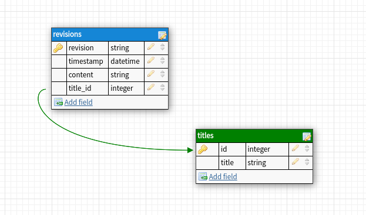

# Wiki Documents API

The take-home assignment is to create a back-end system for a wiki. You can 
find the Swagger API specification in `src/documents/specifications.yaml`

## Installation

The project is using `Flask` as web-dev framework, the database runs on
a docker container using a lightweight version of `PostgreSQL`. 
To run the docker container you can use `docker-compose up` and
it will initialize the database on port `5432` (make sure the port is not being used
by another service).

After running the container, you can perform the first migration by executing:
```
alembic upgrade head
```
This command will create the models used in the backend and will persist until
you execute `docker-compose down`, otherwise you can comment out the `volume`
key in the docker-compose file to create a persistent volume.

## Populate the database

You can populate the database by POST request using the `/documents/{title}` 
endpoint, otherwise you can execute the factory function:

```
python -c "from testing.factory import make_revision; make_revision(commit=True)"
```

Or create multiple instances in one command:

```
python -c "from testing.factory import make_revision; [make_revision(commit=True) for _ in range(10)]"
```

## Database structure
Since the document's title does not change during the life of the document, 
I created a model in which each title has a unique auto-incrementing key.
It communicates with `revision` model through the foreign key `revision.title_id -> titles.id`.

The `revision` field is an `uuid` that identifies a revision.




## Dependencies
You can create a `venv` by installing the dependencies in `requirements.txt`. 
The libraries used in the project are:

* Flask
* [Marshmallow](https://marshmallow.readthedocs.io/en/stable/) to serialize request/response.
* [Alembic](https://alembic.sqlalchemy.org/en/latest/) to perform DB migrations.
* [SQLAlchemy](https://www.sqlalchemy.org/) as ORM.
* [iSort](https://github.com/PyCQA/isort) to sort imports.

I suggest to use at least `python 3.7`, because one of the serializer in the
project uses `datetime.datetime.fromisoformat()` that is a method available from 
`python 3.7+`.

I used `Python 3.8.10`.